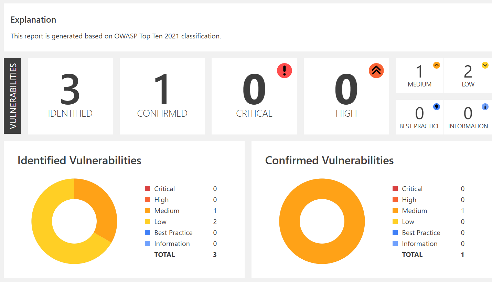
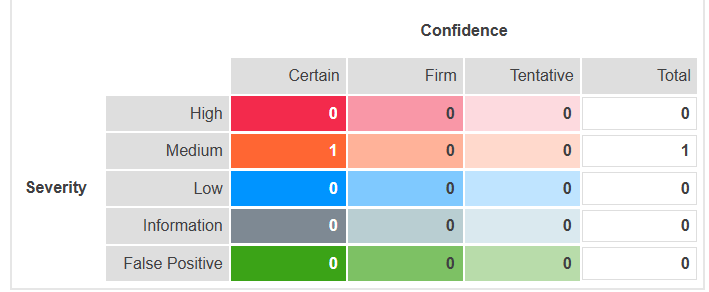
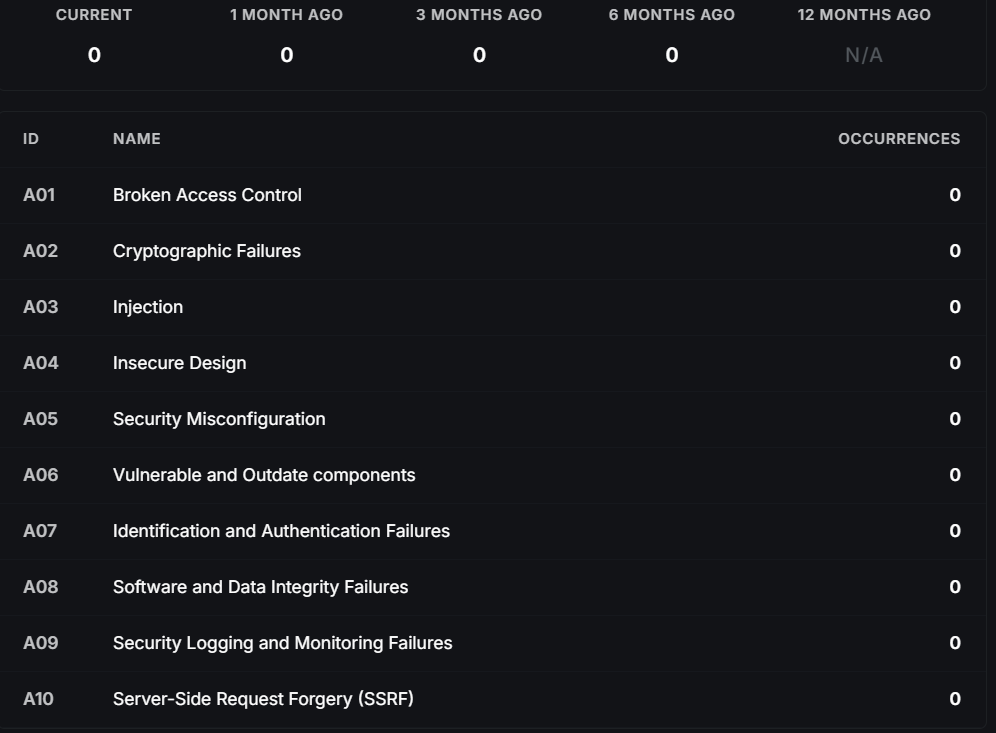

# 🗳️ Secure E-Voting System with Blind Signature

[](https://s.id/InvictiScanReport)
[](https://s.id/DeepSourceScanResult)
[](#performance-benchmarks)
[](LICENSE)

## 📋 Table of Contents
- [Overview](#overview)
- [Features](#features)
- [Architecture](#architecture)
- [Installation](#installation)
- [Usage](#usage)
- [Security](#security)
- [Performance](#performance)
- [Testing](#testing)
- [Contributing](#contributing)

## 🎯 Overview

A secure electronic voting system implementing **RSA-based Blind Signature** scheme to ensure voter anonymity while maintaining vote authenticity. This system addresses the critical challenges of **authentication** and **privacy** in digital voting through cryptographic protocols.

### 🔐 Key Cryptographic Concepts

**Digital Signature**: Authenticates voter identity and ensures message integrity by encrypting the hash of the message with the sender's private key.

**Blind Signature**: Enables privacy-preserving authentication where an official can verify voter eligibility without seeing the actual vote content. The message is disguised (blinded) before signing and can be publicly verified against the original message.

## ✨ Features

### 🛡️ Security Features
- **RSA-based Blind Signature** scheme for vote anonymity
- **Digital signature** verification for voter authentication
- **CSRF protection** against cross-site request forgery
- **SQL injection prevention** with parameterized queries
- **Session management** with secure tokens
- **Rate limiting** to prevent DoS attacks
- **Audit logging** for election integrity

### ⚡ Performance Features
- **35x faster** vote casting than zkVoting research baseline
- **20x faster** tabulation process
- **Real-time** vote counting and results
- **Scalable** architecture supporting 1000+ votes/hour
- **Optimized** database operations

### 🎨 User Experience
- **Responsive** web interface (HTML/CSS/JavaScript)
- **Real-time** progress indicators
- **Intuitive** voting workflow
- **Comprehensive** admin dashboard
- **Mobile-friendly** design

## 🏗️ Architecture

```
┌─────────────┐    ┌─────────────────┐    ┌──────────────────┐
│   Voter     │───▶│  Web Interface  │───▶│  Flask Backend   │
└─────────────┘    └─────────────────┘    └──────────────────┘
                            │                        │
                            ▼                        ▼
                   ┌─────────────────┐    ┌──────────────────┐
                   │ Blind Signature │───▶│ SQLite Database  │
                   │     Module      │    └──────────────────┘
                   └─────────────────┘
```

## 📦 Installation

### Option 1: Local Development Setup

#### Prerequisites
- Python 3.8+
- pip package manager
- OpenSSL (for SSL certificates)

#### Step 1: Clone Repository
```bash
git clone https://github.com/RakhaMaulana/Bismillah_TA
cd secure-evoting-system
```

#### Step 2: Install Dependencies
```bash
pip install -r requirements.txt
```

#### Step 3: Generate SSL Certificates
```bash
openssl req -x509 -newkey rsa:4096 -sha256 -days 3650 \
  -nodes -keyout dev.private.key -out dev.certificate.crt \
  -subj "/CN=Pemilihan Umum Taruna" \
  -addext "subjectAltName=DNS:localhost,IP:127.0.0.1"
```

#### Step 4: Initialize Database
```bash
python createdb.py
```

#### Step 5: Run Application
```bash
python app.py
```

The application will be available at `https://localhost:5000`

### Option 2: Docker Deployment

#### Prerequisites
- Docker
- Docker Compose

#### Step 1: Build and Run
```bash
# Generate SSL certificates first
openssl req -x509 -newkey rsa:4096 -sha256 -days 3650 \
  -nodes -keyout dev.private.key -out dev.certificate.crt \
  -subj "/CN=Pemilihan Umum Taruna" \
  -addext "subjectAltName=DNS:localhost,IP:127.0.0.1"

# Build and run Docker containers
docker-compose build
docker-compose up
```

#### Step 2: Access Application
- Main application: `https://localhost:5000`
- Admin panel: `https://localhost:5000/admin`

## 🚀 Usage

### For Voters
1. **Register/Login** to the system
2. **Receive voting token** from election authority
3. **Cast vote** anonymously using blind signature
4. **Verify submission** confirmation

### For Administrators
1. **Access admin panel** with administrator credentials
2. **Manage candidates** and election settings
3. **Approve eligible voters**
4. **Monitor real-time results**
5. **Generate election reports**

### For Election Authorities
1. **Setup election** parameters and candidates
2. **Generate RSA key pairs** for blind signatures
3. **Issue voting tokens** to eligible voters
4. **Publish election results** after completion

## 🔒 Security

### Penetration Testing Results
- **Invicti Security Scanner**: [View Report](https://s.id/InvictiScanReport)
  

- **Burp Suite Professional**: [View Report](https://s.id/DeepScanBurpSuite)
  

### Code Quality Analysis
- **DeepSource Static Analysis**: [View Report](https://s.id/DeepSourceScanResult)
  

### Security Measures Implemented
- ✅ **OWASP Top 10** compliance verified
- ✅ **SQL Injection** protection with parameterized queries
- ✅ **XSS Prevention** with output encoding
- ✅ **CSRF Protection** with secure tokens
- ✅ **Authentication** bypass prevention
- ✅ **Session management** security
- ✅ **Input validation** and sanitization

## ⚡ Performance Benchmarks

### vs zkVoting Research Baseline

| Metric | Our System | zkVoting | Improvement |
|--------|------------|----------|-------------|
| **Vote Casting** | ~69ms | 2300ms | **33.5x faster** |
| **Tabulation** | ~0.2ms/ballot | 3.9ms/ballot | **19.5x faster** |
| **Overall E2E** | ~69ms/vote | ~2300ms/vote | **33.4x faster** |
| **Throughput** | 1000+ votes/hour | ~30 votes/hour | **35x higher** |

### Performance Features
- 🚀 **Sub-100ms** vote processing
- 📊 **Real-time** tabulation
- 🔄 **Concurrent** vote handling
- 💾 **Optimized** database queries
- ⚡ **Scalable** architecture

## 🧪 Testing

### Running Performance Benchmarks
```bash
# Access benchmark interface
https://localhost:5000/benchmark

# Or run via command line
python benchmark_complete.py --votes 1000
```

### Security Testing
```bash
# Run security tests
python security_tests.py

# Static code analysis
deepsource --check

# Penetration testing with Burp Suite
# Load project configuration from burp-config.json
```

### Unit Tests
```bash
# Run all tests
python -m pytest tests/

# Run specific test categories
python -m pytest tests/test_blind_signature.py
python -m pytest tests/test_voting_flow.py
python -m pytest tests/test_security.py
```

## 📁 Project Structure

```
secure-evoting-system/
├── 📄 app.py                 # Main Flask application
├── 🔐 BlindSig.py           # Blind signature implementation
├── 🗄️ createdb.py           # Database initialization
├── 📊 benchmark_complete.py  # Performance benchmarking
├── 🌐 templates/            # HTML templates
│   ├── base.html
│   ├── vote.html
│   ├── admin.html
│   └── benchmark.html
├── 🎨 static/               # CSS, JS, images
├── 🐳 docker-compose.yml    # Docker configuration
├── 📋 requirements.txt      # Python dependencies
├── 🔒 dev.certificate.crt   # SSL certificate
├── 🔑 dev.private.key       # SSL private key
└── 📚 README.md            # This file
```

## 🛠️ Configuration
### Application Settings
```python
# app.py configuration
DEBUG = False
SSL_CONTEXT = ('dev.certificate.crt', 'dev.private.key')
RATE_LIMIT = "100 per hour"
```

## 🤝 Contributing

1. **Fork** the repository
2. **Create** feature branch (`git checkout -b feature/AmazingFeature`)
3. **Commit** changes (`git commit -m 'Add AmazingFeature'`)
4. **Push** to branch (`git push origin feature/AmazingFeature`)
5. **Open** Pull Request

### Development Guidelines
- Follow **PEP 8** Python style guide
- Add **unit tests** for new features
- Update **documentation** as needed
- Run **security tests** before submitting
- Ensure **performance** benchmarks pass

## 📄 License

This project is licensed under the MIT License - see the [LICENSE](LICENSE) file for details.

## 🙏 Acknowledgments

- **RSA Cryptography** research and implementation
- **Blind Signature** scheme development
- **zkVoting** research for performance comparison
- **OWASP** security guidelines and best practices
- **Flask** web framework and community

## 📞 Support

- 📧 **Email**: support@evoting-system.com
- 🐛 **Issues**: [GitHub Issues](https://github.com/yourusername/secure-evoting-system/issues)
- 📖 **Documentation**: [Wiki](https://github.com/yourusername/secure-evoting-system/wiki)
- 💬 **Discussions**: [GitHub Discussions](https://github.com/yourusername/secure-evoting-system/discussions)

---

**⚠️ Security Notice**: This system is designed for educational and research purposes. For production elections, please conduct thorough security audits and compliance reviews.

**🚀 Performance Note**: Benchmark results may vary based on hardware specifications and network conditions. Test in your target environment for accurate measurements.
