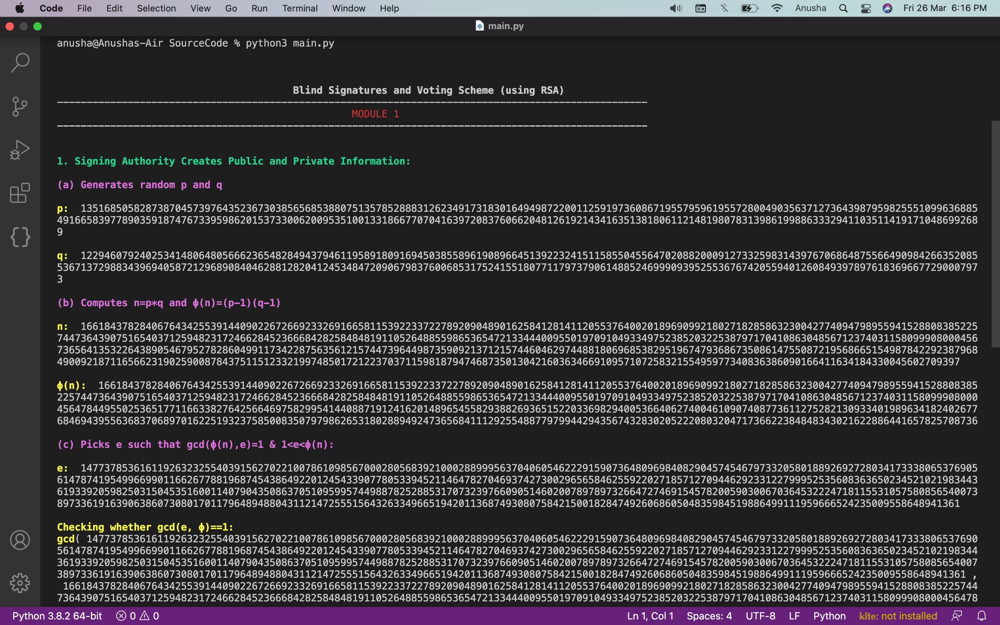
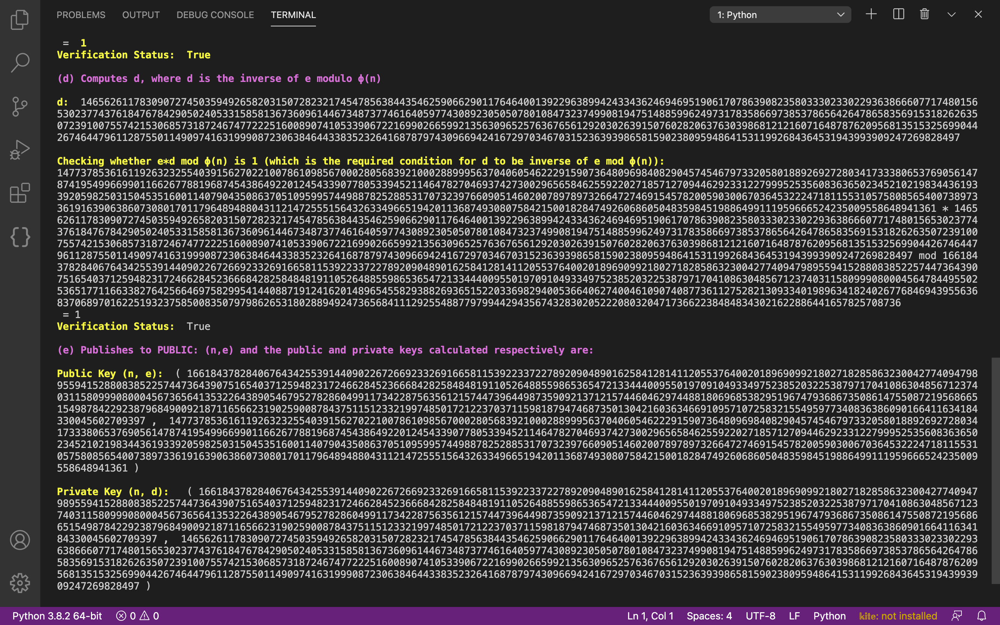
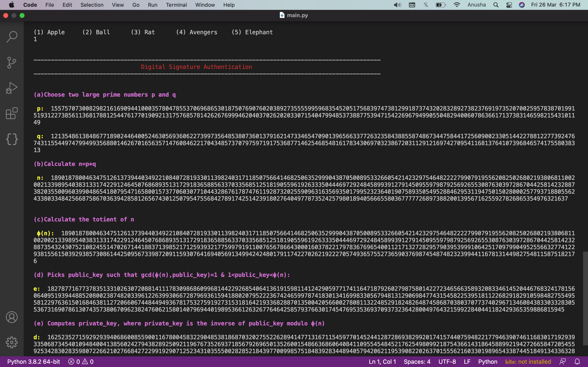
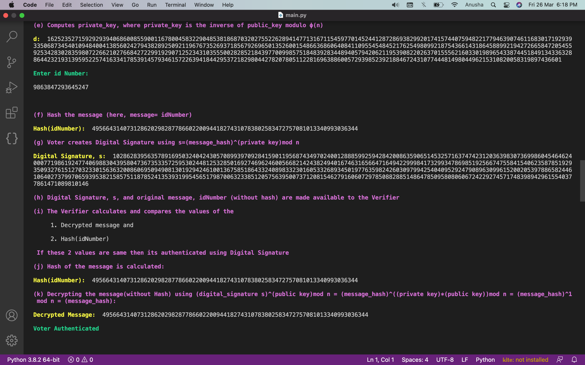
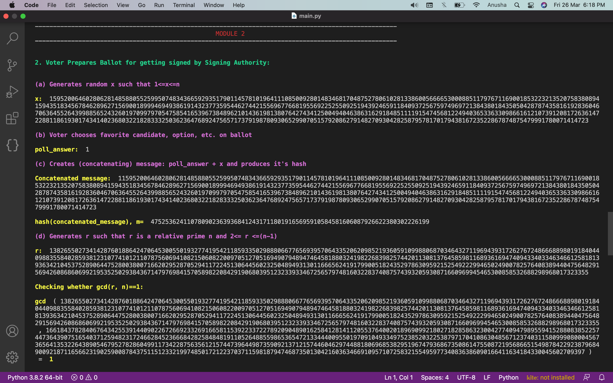
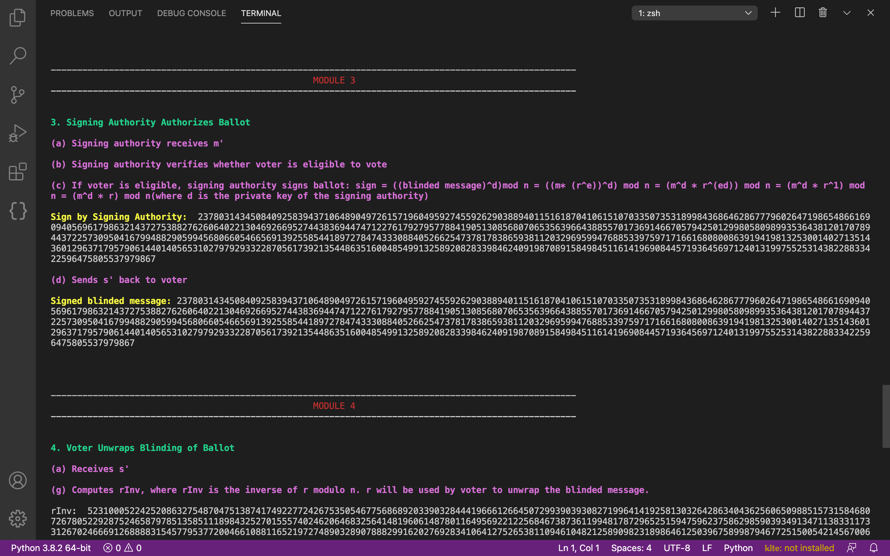
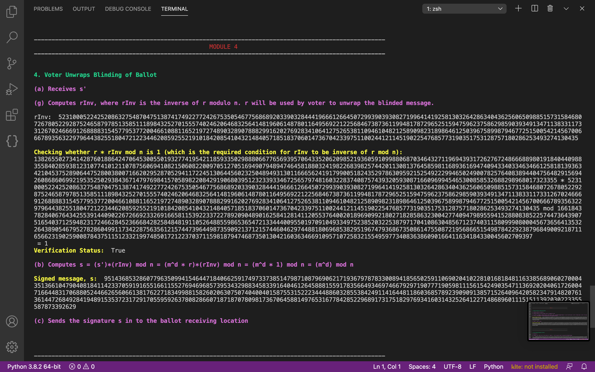
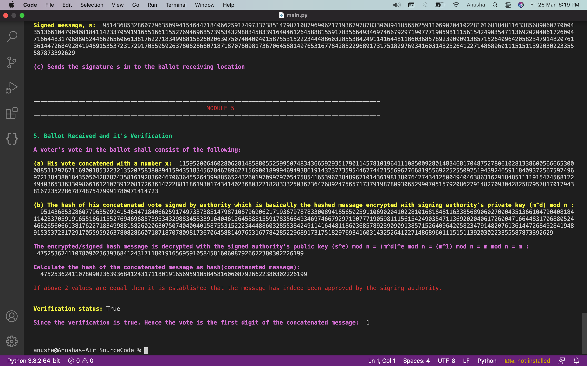

# Secure E-Voting Mechanism using Blind Signature and Digital Signature

## Introduction

In recent years, there has been rapid growth in the field of computer networks. Today, more and more people have obtained access to the internet. In many nations, voter turnout has been a major reason for concern and this could be vastly improved if it were carried out electronically through E-Voting. To overcome the challenges of authentication and privacy we propose to use a combination of digital signatures and blind signatures. The voter can be authenticated with the help of his digital signature. The voters’ privacy can be guaranteed by using blind signatures to ensure confidentiality. 

A digital signature is generally used to authenticate the identity of a sender and also make sure that the original contents of the message have not been altered. This is generally done by encrypting the hash of the message with the sender's private key. Henceforth the receiver may first decrypt the hash with the sender's public key and then compare it with the hash of the original message. 

Blind signature is used in privacy-related protocols, where the message author and signer are different parties. In the case of a voting application, we may need an official to verify if the voter is eligible but we shall not want him to see his message. Hence this is an apt situation for the usage of blind signatures. A Blind Signature is nothing but a digital signature in which the content of the message is disguised (blinded) before it is signed. The blind signature can be publicly verified against the original, unblinded message in the same manner as a regular digital signature. 

## Objectives

1. To understand the concept of digital signatures and blind signatures and how they guarantee authentication and confidentiality. 

2. To create a python based E-Voting application with the usage of blind signatures and Digital signatures. 

3. To run the voting application successfully and verify the cryptographic scheme (blind signatures and digital signatures) used and ensure no vulnerabilities in the E-Voting application. 

## Project Deliverables

A python-based implementation of an E-Voting application with the use of blind signatures and digital signatures. The application shall log the usage of keys and display the cryptographic processes that would take place under the hood as well so that the usage of cryptography can be confirmed. 

## Related Papers

- [Secure E-Voting With Blind Signature](https://core.ac.uk/download/pdf/11779635.pdf)

- [Blind Signatures for Untraceable Payments](https://sceweb.sce.uhcl.edu/yang/teaching/csci5234WebSecurityFall2011/Chaum-blind-signatures.PDF)

## Working

###### 1. Signing Authority Creates Public and Private Information:

   (a) Generates random p and q

   (b) Computes n=p*q and ϕ(n)=(p-1)*(q-1)

   (c) Picks e such that gcd(ϕ(n),e)=1 & 1< e <ϕ(n)

   (d) Computes d, where d is the inverse of e modulo ϕ(n)

   (e) Publishes to Public, the Public key: (n,e) and keeps the private keys to himself.

  ###### Digital Signature Authentication using RSA approach

    (a) Choose two large prime numbers p and q 

    (b) Calculate n=p*q 

    (c) Calculate the totient of n 

    (d) Picks public_key such that gcd(ϕ(n),public_key)=1 & 1 < public_key < ϕ(n)

    (e) Computes private_key, where private_key is the inverse of public_key modulo ϕ(n) and the idNumber of the Voter is entered.

    (f) Hash the message (here, message= idNumber)

    (g) Voter creates Digital Signature using s=(message_hash)^(private key) mod n 

    (h) Digital Signature, s, and original message, idNumber (without hash) are made available to the Verifier 

    (i) The Verifier calculates and compares the values of the

       (1) Decrypted Message

       (2) Hash(idNumber) 
    
        If the above 2 values are the same then its authenticated using Digital Signature

    (j) Hash of the message ie, Hash(idNumber) is calculated

    (k) Decrypting the message(without Hash) using 

           (digital_signature s)^(public key)mod n 

         = (message_hash)^((private key)*(public key))mod n 

         = (message_hash)^1 mod n 

         = (message_hash)

###### 2. Voter Prepares Ballot for getting signed by Signing Authority

    (a) Generates random x such that 1<=x<=n

    (b) The voter chooses their favourite candidate, option, etc. on the ballot

    (c) Creates (concatenating) message: poll_answer + x and produces its hash, ie, hash(concatenated_message) denoted by m

    (d) Generates r such that r is a relative prime n and 2<= r <=(n-1)

    (e) Computes blinded message (disguises his message): 

        m' = (m* (r^e)) mod n 
        (where n and e are public knowledge)

    (f) Sends m'(blinded message) to signing authority

###### 3. Signing Authority Authorizes Ballot

    (a) Signing authority receives m'

    (b) Signing authority verifies whether voter is eligible to vote

    (c) If voter is eligible, signing authority signs ballot: 
        
        sign = ((blinded message)^d)mod n 
             = ((m* (r^e))^d) mod n 
             = (m^d * r^(ed)) mod n 
             = (m^d * r^1) mod n 
             = (m^d * r) mod n    (where d is the private key of the signing authority)

    (d) Sends s' back to voter

###### 4. Voter Unwraps Blinding of Ballot

    (a) The voter receives sign s'

    (b) Computes rInv, where rInv is the inverse of r modulo n. The r is used by the voter to unwrap the blinded message and the value of r is private to the voter only.

    (c) Computes s 

        = (s')*(rInv) mod n 

        = (m^d * r)*(rInv) mod n 

        = (m^d * 1) mod n 

        = (m^d) mod n

    (d) Sends the signature s into the ballot receiving location

###### 5. Ballot Received and its Verification 

    A voter's vote on the ballot shall consist of the following: 

    (1) His vote concatenated with a number x

    (2) The hash of his concatenated vote signed by the authority which is basically the hashed message encrypted with signing authority's private key (m^d) mod n 

    The encrypted/signed hash message is decrypted with the signed authority's public key 

          (s^e) mod n 

        = (m^d)^e mod n 

        = (m^1) mod n 

        = m mod n (since m < n)

        = m  

Calculate the hash of the concatenated message as hash(concatenated message) 

If the values of the hash and the decrypted message are equal then it is established that the message has indeed been approved by the signing authority. (the hash algorithm is public)

If the verification is true, the vote is the first digit of the concatenated message

## Use

- Run using `python3 main.py`
